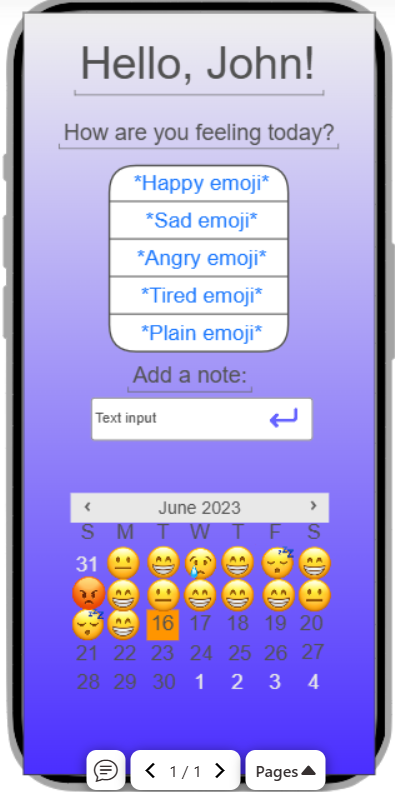

# Mood tracker
Startup for CS 260
## Specification Deliverable
### Elevator Pitch
Imagine a simple app that asks you one question every day: “How are you feeling today?” With just a tap, choose an emoji to reflect your mood and optionally jot down a quick note. 
The app organizes your entries into a beautiful calendar view, so you can spot trends and reflect on your emotional journey.

But here’s the twist: other people, friends and strangers, can see your emoji for the day. If you’re feeling anything less than happy, they can send you a little extra love with a heart. 
You’ll instantly get a notification saying, “John gave you some love!” It’s a gentle way to share your feelings, stay connected, and get a boost when you need it most.

Start building an emotional support circle while gaining insights into your own well-being one emoji at a time.

### Design

### Key Features
- Secure login over HTTPS
- Push notification to user daily
- Display emotion options
- Ability to record daily emotion and optional note
- Ability to see your past recorded emotions in a calendar view
- Ability to see other user's daily emotion (when not happy)
- Ability to "send love" to other users
- Users receive real-time notifications when they receive love from other users

### Technologies
- HTML: Uses correct HTML. Three HTML pages, a login page, enter your feelings page, and "send some love" page.
- CSS: Application looks aesthetically pleasing. Website works on different screen sizes, including on mobile. Good use of white space.
- React: Provides login, emotion choice display, choosing your daily emotion, adds your daily emotion to the calendar, enters optional note, displays other users emotions, sending love to other, backend endpoint calls.
- Service: Backend service with  endpoints for:
    - Retrieving emotion choices
    - Submitting daily emotion choice
    - Retrieving other user's emotions
- DB/Login: Stores users, emotion choices (per date), emotional daily notes in databse. Register and login users. Credentials stored in databse. Can't add to your mood tracker or send love without logging in.
- Websocket: Each time a user receives love, they will be notified. Everyday, a message will go to each user asking "How are you feeling today?"

## HTML Deliverable
I created the HTML for the startup which includes the index(login), the moodtracker, and the share some love pages. Each are linked with the NAV tag. The index page has login placeholder features that will be implemented when the database is set up.

The moodtracker page has a section where daily emotion can be selected and an optional text can be added. A 3rd party placeholder checks the date. This will ensure that the user can only enter one entry per day. The emotion, note, and date stored will be added later to the databse. There is a calendar section that will retrieve the data from the entry of that date, this function will be implemented when the database is set up.

The share some love page includes an interactive feature where the database will pull other user's daily entries and you can press a button to "give them love". When implemented with WebSocket, the other user will recieve a realtime notification saying, "*User* sends some love!".

All HTML is structured in an organized way and functions properly. Placeholders are used for login, database, and WebSocket features.